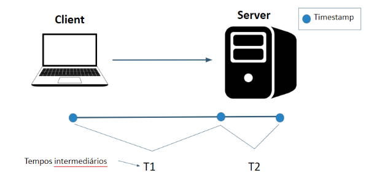
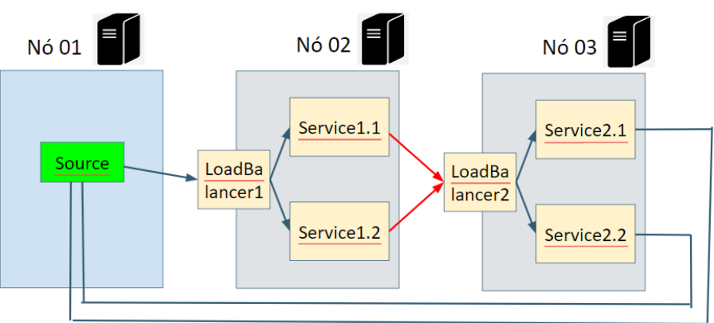
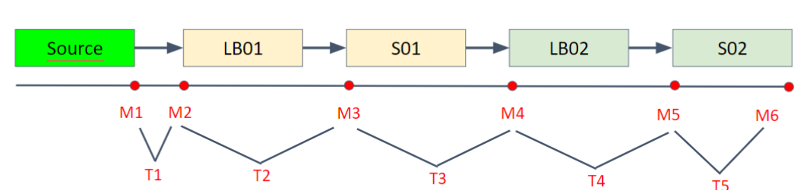
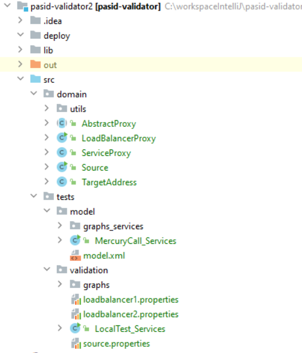
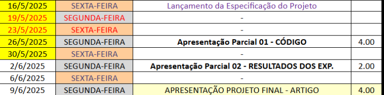

# TRABALHO FINAL DA DISCIPLINA DE SISTEMAS DISTRIBUÍDOS (SOBRE PASID-VALIDATOR)


[VIDEO EXPLICATIVO DO PROJETO](https://youtu.be/Fv1OZV-fvcU)

## IDEIA GERAL

Validar um modelo de **Stochastic Petri Net (SPN)** com experimentos significa verificar se o modelo teórico (SPN) representa adequadamente o sistema real que ele tenta modelar, e se as suas previsões ou simulações são consistentes com os dados observados ou resultados experimentais. A validação de um modelo SPN envolve a comparação entre o comportamento do modelo (como tempos de espera, taxas de processamento, ou qualquer outra métrica de interesse) e o comportamento de um sistema real ou os resultados de experimentos controlados.

Escrito em Java, O PASID-VALIDATOR serve para montar um sistema distribuído cliente-servidor(es) e captura os tempos de cada etapa do processamento.

Para este trabalho vocês não irão usar nada de SPN apenas usar a ferramenta e coletar dados de desempenho de um serviço específico.

## NOMENCLATURA DOS TEMPOS

Por vários motivos usamos a métrica tempo médio de resposta (MRT) para validação.

A imagem abaixo mostra a ideia dos tempos coletados.



**Timestamps (marcos temporais):** Representados pelos pontos azuis ao longo do caminho entre o cliente e o servidor. Esses pontos indicam os momentos em que os tempos são registrados, como:

- O tempo que a mensagem leva para sair do cliente até o servidor.
- O tempo que a mensagem leva para voltar do servidor até o cliente.

**Tempos intermediários:** Estes tempos são tempos de cada etapa. A linha destacada mostra dois momentos de interesse no caminho: o T1 e o T2. Esses pontos são tempos intermediários que podem representar, por exemplo:

- T1: O momento em que o servidor recebe a solicitação do cliente.
- T2: O momento em que o servidor processa e envia a resposta de volta ao cliente.

## EXEMPLO COM TRÊS NÓS

A imagem abaixo representa um sistema distribuído com três nós, cada um contendo diferentes componentes que trabalham em conjunto.  



### 1. Nó 01 - Source

O primeiro nó (Nó 01) contém um componente chamado Source, representado em verde, responsável por gerar ou fornecer dados para o sistema. Ele é o ponto de origem de onde as solicitações ou mensagens são enviadas para processamento e também o componente que irá compilar os resultados e fazer o cálculo final da validação.

### 2. Nó 02 - LoadBalancer1 e Serviços

- O Nó 02 possui um LoadBalancer1, responsável por distribuir as solicitações recebidas do Source entre dois serviços: Service1.1 e Service1.2.
- O LoadBalancer1 atua como um balanceador de carga, direcionando as tarefas de forma balanceada ou de acordo com algum critério específico, para os serviços de processamento.
- O Nó 02 é responsável por uma parte do processamento, onde os serviços 1.1 e 1.2 recebem suas respectivas cargas de trabalho.

### 3. Nó 03 - LoadBalancer2 e Serviços

- O Nó 03 possui um LoadBalancer2, que distribui as solicitações recebidas entre dois serviços: Service2.1 e Service2.2.
- As setas mostram que LoadBalancer2 recebe solicitações vindas do Nó 02 (os serviços 1.1 e 1.2), indicando que, após o processamento inicial no Nó 02, as tarefas são encaminhadas para o Nó 03 para continuar o processamento.

### 4. Fluxo de Comunicação

- As setas no diagrama indicam o fluxo de comunicação:
  - O **Source** no Nó 01 envia solicitações para o **LoadBalancer1** no Nó 02.
  - O **LoadBalancer1** distribui essas solicitações entre **Service1.1** e **Service1.2**.
  - Após o processamento inicial, as tarefas são enviadas para o **LoadBalancer2** no Nó 03.
  - O **LoadBalancer2** distribui as tarefas entre **Service2.1** e **Service2.2** para um processamento adicional.
  - O sistema segue um fluxo encadeado onde os dados fluem de um nó para outro, com balanceadores de carga gerenciando a distribuição de trabalho em cada etapa.

A imagem abaixo mostra o mapeamento dos tempos intermediários.



## ENTENDENDO O PROJETO

A imagem abaixo mostra o layout do projeto.



Vamos focar na pasta tests. Aqui você encontra as pastas model e validation. Primeiro observe model, onde temos o modelo xml em si e a classe MercuryCall_Services que executa o modelo e gera gráficos na pasta graphs_services.

**Você não irá usar o conteúdo da pasta model, então você pode apagá-la.**

A pasta validation é onde executa o experimento em si, a qual você irá usar. A classe LocalTest_Services lê os três arquivos properties e executa a validação.

Aqui está uma explicação do que esses tipos de arquivos representam e como eles são usados no contexto de sistemas distribuídos e balanceadores de carga:

### loadbalancer2.properties

Este arquivo é um arquivo de propriedades que contém as configurações específicas para o segundo balanceador de carga no seu sistema (o LB02). Essas configurações podem incluir:

- Limites de carga: O número máximo de solicitações ou conexões que o balanceador pode distribuir.
- Política de balanceamento: Definições sobre como o balanceador distribui as requisições entre os serviços. Pode ser por round-robin, menor carga, ou com base em métricas específicas.
- Tempos de resposta: Configurações relacionadas ao tempo de espera ou timeout, que podem definir quanto tempo o balanceador deve aguardar uma resposta antes de redistribuir uma solicitação.
- Parâmetros de rede: Detalhes de configuração da rede, como endereços IP ou portas que o balanceador utiliza para se conectar aos serviços.

Esses parâmetros controlam o comportamento do balanceador, garantindo que ele distribua as cargas de forma eficiente e dentro dos limites aceitáveis.

### source.properties

Este arquivo de propriedades está relacionado ao componente Source, que é responsável por gerar ou fornecer solicitações ao sistema. As configurações nesse arquivo podem incluir:

- **Taxa de geração de solicitações:** A frequência com que o Source gera novas solicitações ou mensagens a serem distribuídas pelo sistema.
- **Destinos das solicitações:** Os endereços ou serviços para os quais as solicitações serão enviadas.
- **Parâmetros de conexão:** Configurações sobre como o Source se conecta aos serviços, como IPs, portas, e timeout.
- **Parâmetros de simulação:** Se o Source estiver simulando um comportamento de entrada de dados, ele pode conter parâmetros para ajustar a carga gerada ou o tipo de tráfego simulado.

Esses parâmetros permitem que o Source ajuste dinamicamente a carga de trabalho enviada para os balanceadores e serviços no sistema, o que pode ser útil para testar e validar o comportamento do sistema sob diferentes condições de carga.

Agora vamos voltar às etapas explicadas no início deste documento

**EXECUÇÃO EXPERIMENTAL DE COLETA:** Alterar a variável modelFeedingStage para true e executar LocalTestServices
O resultado sai assim:

```bash
The times to feed the models transitions are the following:
T1 = 226.33333333333334
T2 = 72.0
T3 = 177.0
T4 = 13.333333333333334
T5 = 2030.3333333333333
```

Estes são os tempos que você pode usar para gerar gráficos de desempenho.

## ESPECIFICAÇÃO DO TRABALHO

- **ENTREGA 01- CÓDIGO:** Vocês deverão fazer o PASID-VALIDATOR versão com código em Python.
- **ENTREGA 02 – EXPERIMENTOS:** Vão executar experimentos usando os componentes em docker containers (1 SOURCE, 2 LOAD BALANCERS). Na parte do Service deverão colocar um código de um serviço real, de preferência com IA e que seja pesado. Deverá ter gráficos de linha sobre o MRT, você pode mudar fatores (linhas) como tipo de serviço e quantidade de services, considerando o x sendo taxa de geração que é mais comum em artigos. Aqui exemplo só pra ter uma base do visual dos gráficos [https://www.overleaf.com/read/zvrngyctpknz#010027](https://www.overleaf.com/read/zvrngyctpknz#010027)
- **ENTREGA 03 - ARTIGO:** Escreverão um artigo explorando o experimento realizado, mínimo 8 páginas template Latex da IEEE.



## Resultados
